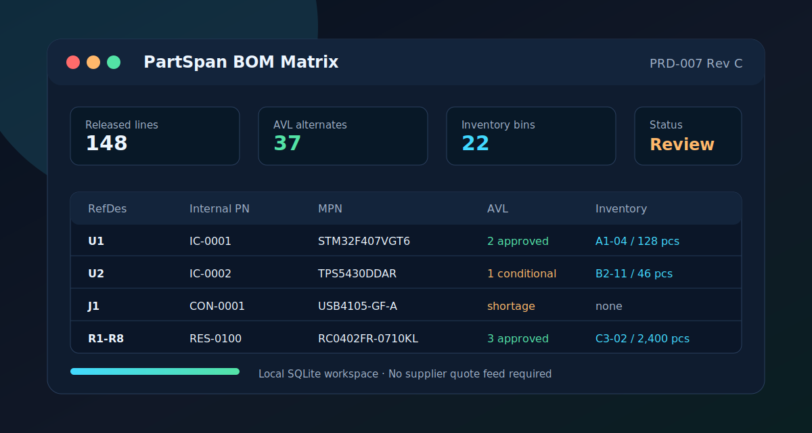

# PartSpan Free Edition

Local-first BOM, AVL, RefDes, and inventory management for electronics teams moving beyond spreadsheet BOM control.

[Download PartSpan](https://partspan.evelyn-ai.com/#download) · [Website](https://partspan.evelyn-ai.com/) · [v0.1.1 release](https://github.com/papalon0505/partspan-site/releases/tag/v0.1.1) · [SHA-256 checksums](https://partspan.evelyn-ai.com/SHA256SUMS.txt)

## Why It Exists

Small hardware teams often manage product BOMs in spreadsheets until RefDes, AVL alternates, inventory bins, and revision control become hard to trust. PartSpan keeps that work local in a desktop app, without requiring a supplier quote feed or cloud PLM account.

## Free Edition

- Local SQLite workspace storage
- CSV, TSV, and XLSX BOM import
- BOM Matrix review and release flow
- RefDes and footprint visibility
- AVL alternate tracking
- Inventory bin locations
- Where-used impact checks
- Workspace JSON export and sample BOM import
- English and Traditional Chinese interface

## Downloads

Current public release: [PartSpan Desktop v0.1.1](https://github.com/papalon0505/partspan-site/releases/tag/v0.1.1)

| Platform | Installer |
| --- | --- |
| macOS Apple Silicon | [PartSpan-0.1.1-mac-arm64.dmg](https://github.com/papalon0505/partspan-site/releases/download/v0.1.1/PartSpan-0.1.1-mac-arm64.dmg) |
| Windows x64 | [PartSpan-0.1.1-win-x64.exe](https://github.com/papalon0505/partspan-site/releases/download/v0.1.1/PartSpan-0.1.1-win-x64.exe) |

Verify installers with [SHA256SUMS.txt](https://github.com/papalon0505/partspan-site/releases/download/v0.1.1/SHA256SUMS.txt).

## Security Notes

- macOS DMG and app are signed, notarized by Apple, and stapled.
- Windows installer is not yet code-signed, so SmartScreen may show a warning.
- BOM data stays in the local workspace database on the user's machine.

## 中文簡介

PartSpan Free Edition 是給電子硬體團隊使用的本機 BOM 管理工具，可管理 BOM Matrix、RefDes 位號、AVL 替代料與庫存位置。核心使用不需要供應商報價 API，也不需要把公司 BOM 上傳到雲端。

## Repository Scope

This public repository hosts the product website, public downloads, checksums, and sample BOM material. The private product source remains separate.
